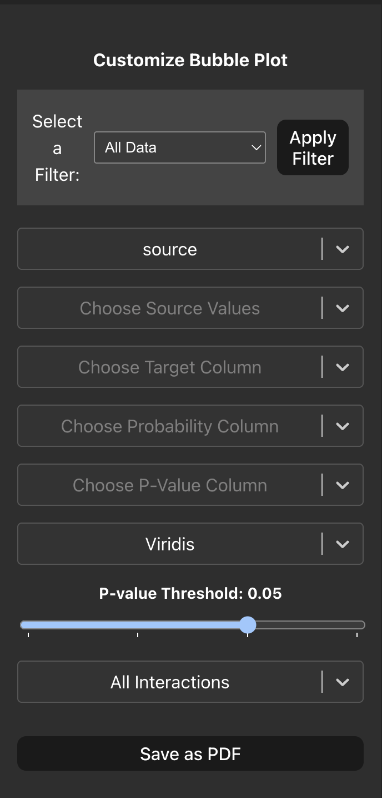
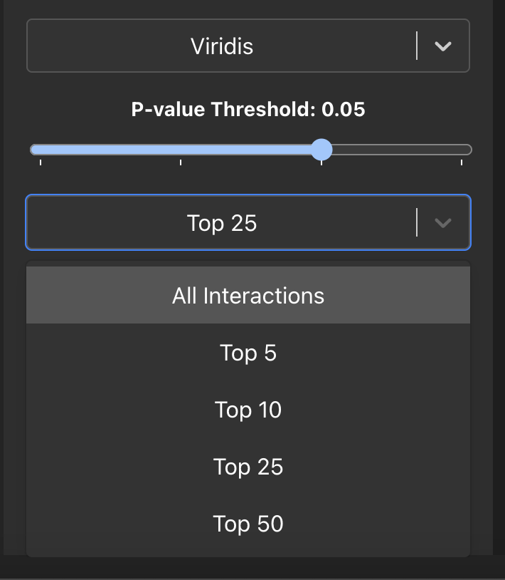
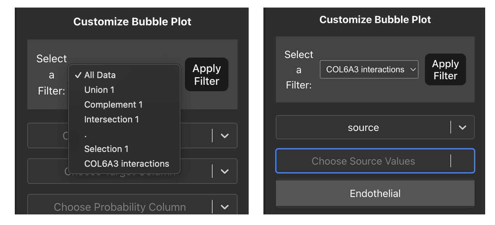
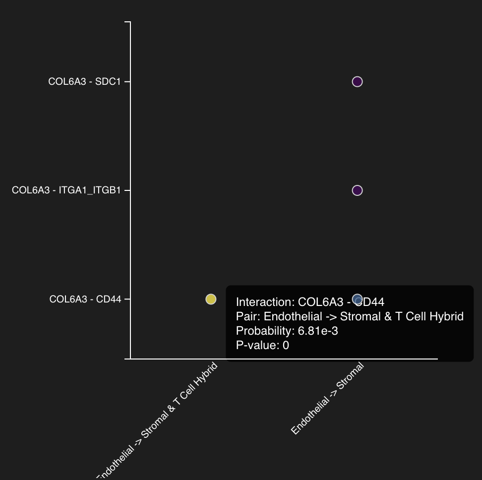

# Bubble Plot
A bubble plot is a convenient way for us to visualise cell-cell interactions of interest between cell types. This plot has ligand-receptor pairs along the y-axis and cell type pairs along the x-axis, the size of the bubble is determined by the p-value with larger p-values resulting in a larger bubble and the colour of the bubble represents how strong/probable an interaction is. 

First, select the columns in your interaction table that contains the source cell type information, after this another drop-down menu will appear that contains the unqiue cell type values in your source column here you can choose multiple cell types of interest that are expressing a ligand. Similarly, we then repeat the same for the target column, these will be the cell types of interest that are expressing the receptor. After this we can proceed and choose the columns that contain our interaction probability and p-value data at which point the plot will automatically render. 

We can also change the colour scheme for the plot using the dropdown menu to select various colour maps. We can also use the slider to select different p-value threshold cutoffs allowing control for highly significant interactions. Finally, in the case where our parameters have returned too many interactions we can focus on the strongest interactions by using the last dropdown which allows us to visualise up to the top 50 interactions ordered by their probability. 

### Plotting Single Cell View/Table row selections
At the top of the sidebar we can also pass our previous selections we made in the Single Cell View tab and Interactions Table tab by using the dropdown menu. Once you have selected a value from the dropdown menu and click 'Apply Filter' the source and target cell type values will be limited to only those that appear in your selections, allowing you to plot your interactions of interest.

You can also hover over each bubble and a hover box will appear that will show you additional informatino about the plotted interactions such as:
    - The ligand receptor pair
    - The interacting cell types 
    - The interaction probability
    - The p-value of the interaction

Once you are happy with your bubble plot you can save it by clicking the 'Save as PDF' button that will show you a pop-up box allowing you to input the filename, plot dimensions in centimetres and the DPI for further use.
