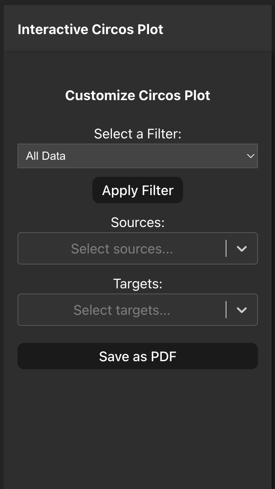
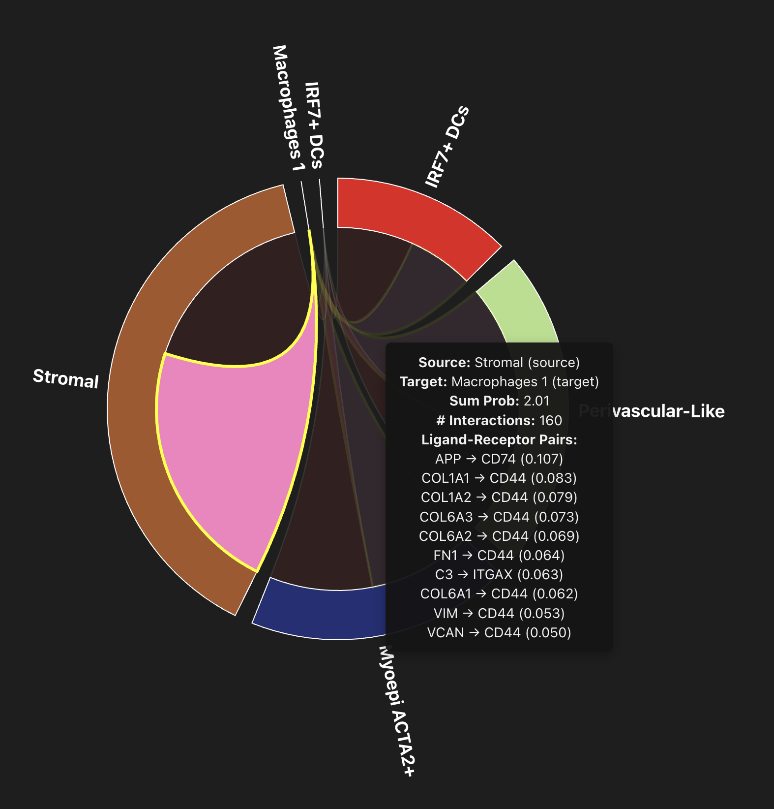
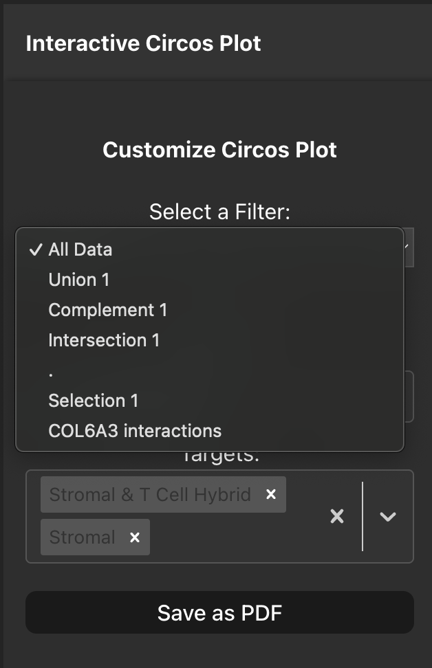

# Circos Plot
A circos plot is another way for us to visualise interacting cell types of interest. Here we each segment represents a source cell type (i.e. expressing ligand) that is received by a target cell type. The chords of the circos plot represent the directionality of the interaction and are coloured by the target cell type, the thickness is showing the aggregated probability of the interactions.

In the side bar select your sources and targets of interest and the plot will automatically update with your selections. 

You can also hover over chords to see additional information such as:
    - The source cell type
    - The target cell type
    - The aggregated probability of the interactions
    - The total number of interactions
    - The top 10 strongest ligand-receptor pairs

### Plotting Single Cell View/Table row selections
At the top of the sidebar we can also pass our previous selections we made in the Single Cell View tab and Interactions Table tab by using the dropdown menu. Once you have selected a value from the dropdown menu and click 'Apply Filter' the source and target cell type values will be limited to only those that appear in your selections, allowing you to plot your cell types of interest.

You can also export the circos plot as a PDF by clicking the 'Save as PDF' button in the sidebar. 

NB: The plot area is large for the circos plot so it is best once your selections have been made in the sidebar that you scroll over to view the whole plotting area, this also avoids the hover boxes being cut out of view.