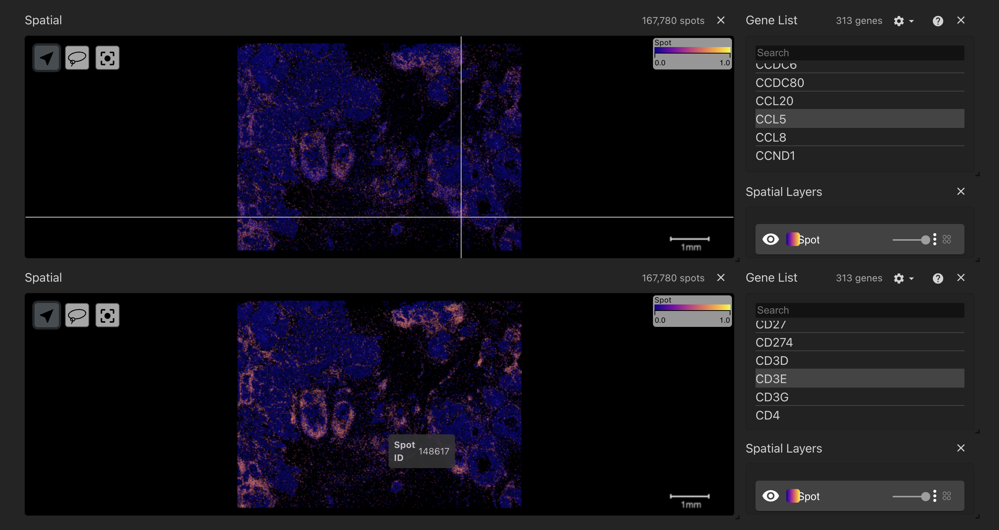

# Ligand-Receptor Search

The dual spatial view allows users to explore ligands and receptors in their spatial context where available. Users can compare two spatial plots side-by-side, select different genes in each view using the Gene List components and check for spatial co-localisation of ligands and/or receptors in space. For ease of usability when an area is hovered over in one spatial view then the same location is tracked in the second spatial view highlighted by a white line tooltip. The Gene List components functionality is explained in detail on the Single Cell View page.

NB: Including spatial cell type on this view is a feature to be implemented.