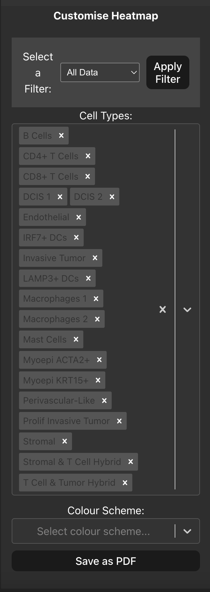
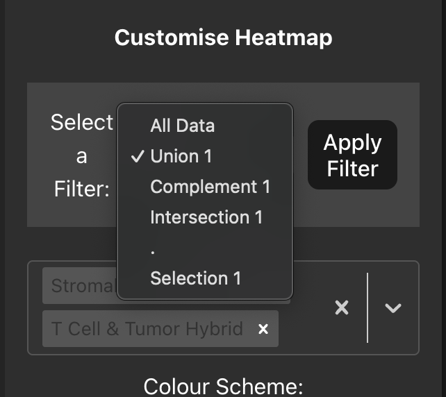

# Heatmap
It is also helpful to know how many interactions we have between cell types, here we plot a heatmap of the frequency of interactions in our data. By default all the cell types are plotted for a global view of the interaction data, in the sidebar you can remove or add cell types that you want to be included in the heatmap. You can also change the colour scheme of the heatmap using the drop-down menu in the sidebar to select a different colour map. 

### Plotting Single Cell View/Table row selections
Similarly to the Bubble Plot tab you can also pass the previous selections we made in the Single Cell View tab and Interactions Table tab by using the dropdown menu. Once you have selected a value from the dropdown menu and click 'Apply Filter' the source and target cell type values will be limited to only those that appear in your selections, allowing you to plot the interaction frequency between the cell types of interest.

The heatmap can also be exported to a PDF by clicking the 'Save as PDF' button in the sidebar for further use.
