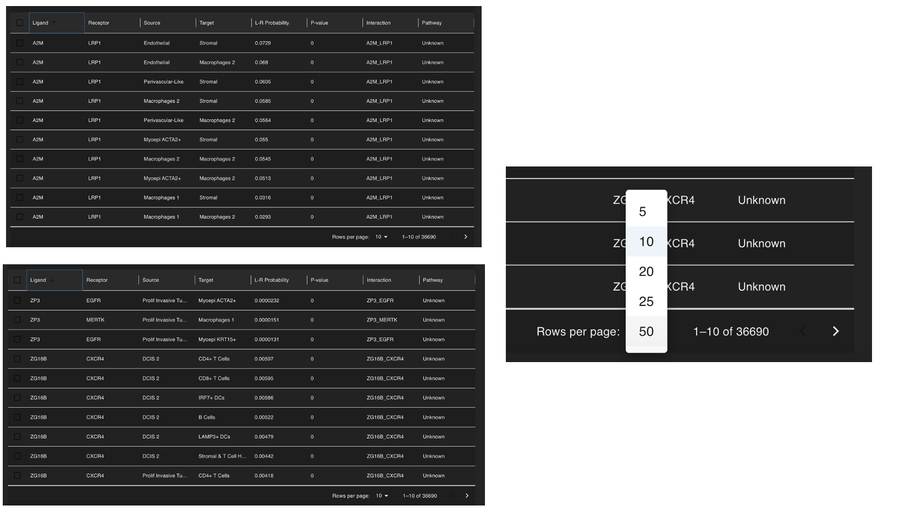
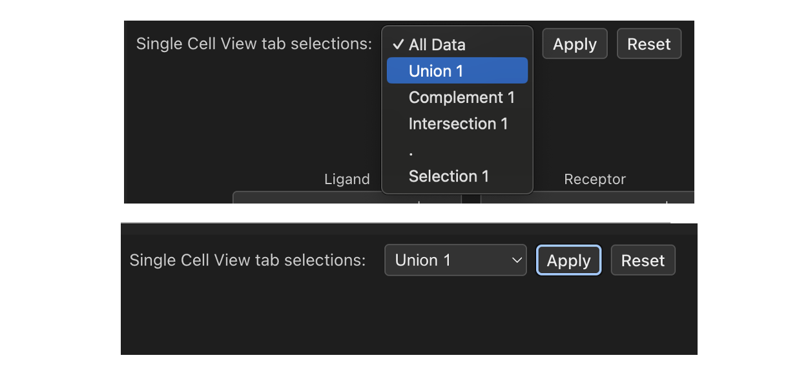
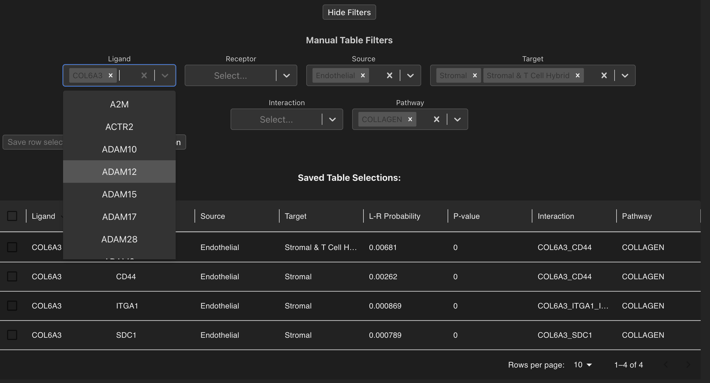
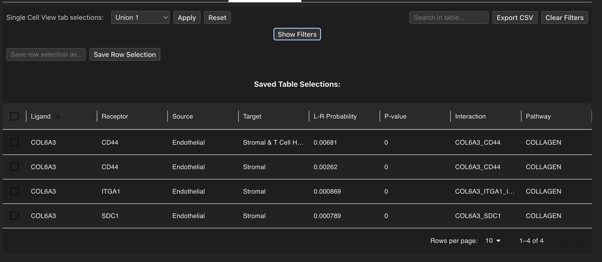
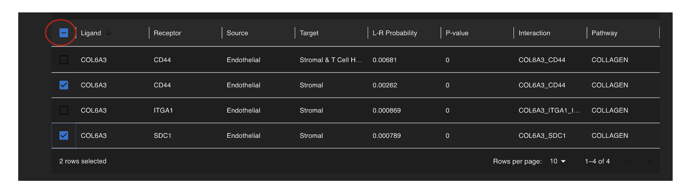
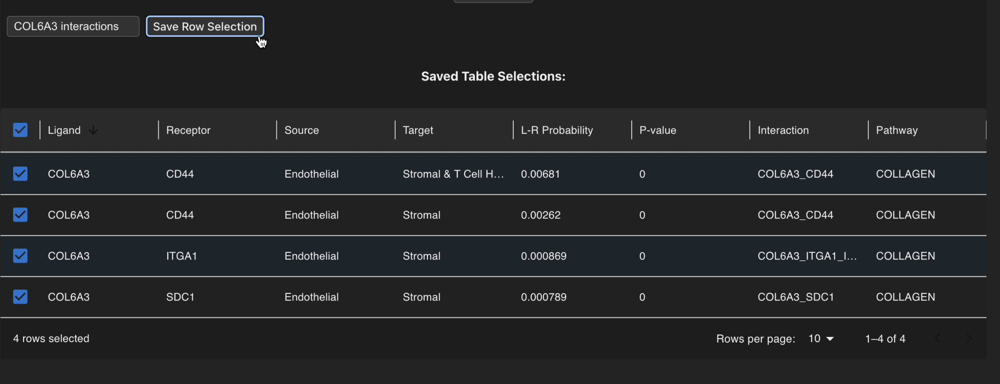
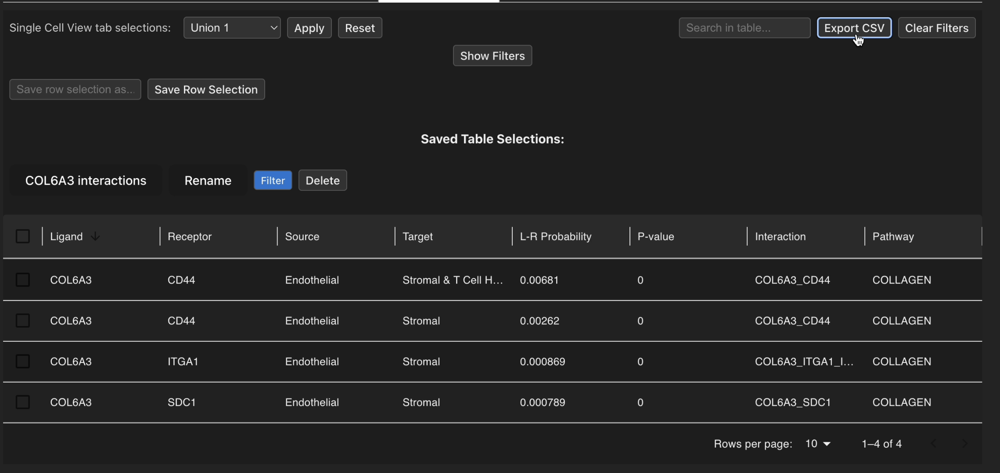

# Interaction Table

Here the user can explore their cellular interaction data in an easy table format that has many filtering options to find cellular interactions of interest. Columns that contain text such as Ligand or Source can be clicked to sort the table either in descending alphabetical order or double-clicked for ascending alphabetical order. Similarly, numerical columns can be clicked to sort from descending order or double-clicked for ascending order. By default the table view shows 10 interactions per page, however this can be changed using the paginator at the bottom to display more rows and to navigate between pages of the table.

## Filtering interactions
The table view offers a wide range of powerful filtering strategies located above the table to delve into your interaction data. There are two main ways to do this:

### Single Cell View selection filtering
On the top left-hand side of the page the user can subset their interaction data based on the interactions that have been computed in the selections they previously created in the Single Cell View tab. After a selection is chosen from the drop-down menu, you can apply the filters using the 'Apply' button which will update the table to show interactions that have been computed between the cell types that exist in that selection. By clicking the 'Reset' button you may then revert the table back to the full dataset. 

### Multi-value manual filtering
You can also filter the cell-cell interaction results using the values present in the columns of your table. You may search for things such as:
    - Ligands
    - Receptors
    - Source cell types
    - Target cell types
    - Ligand-receptor pairs
    - Interaction pathways

Each of these factors can accept multiple values so that you can conduct a diverse search with different parameters to find interactions of interest. Elements can also be searched for using the search bar at the top right of the page, and if filters need to be removed then this can easily be done either using the 'Clear Filters' button or by removing values selected in the drop-down menus directly. 

For ease of readability you can also collapse/expand the filtering drop-down options by clicking on the 'Hide Filters' button.

## Selecting and saving selections
Each row can also be selected/unselected by clicking on tickboxes that are located on the left of each row in the table, with all rows being selected/unselected by toggling the master tickbox at the top of the table. 

Once filtering strategies are applied we can utilise the row selection functionality and store these interactions of interest by selecting rows, then assigning a name to the selection using the type box underneath the filtering functions and clicking 'Save Row Selection'. 

Then the saved selection will appear underneath where the user can rename, delete or filter the table to show those interactions. The interaction table can also be exported as a CSV file using the 'Export CSV' button in the top right corner so that filtered interactions of interest can be saved for further use. 

NB: The 'Export CSV' button will save the current state of the displayed table, so ensure you have applied all desired filters before saving!

