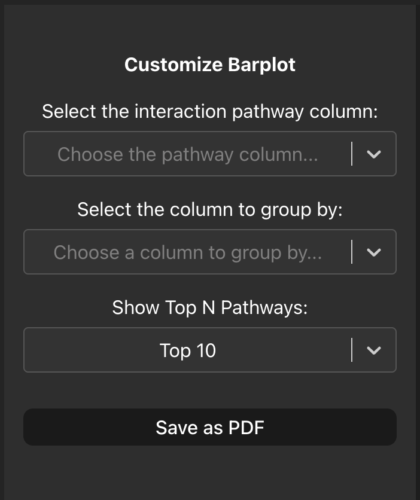
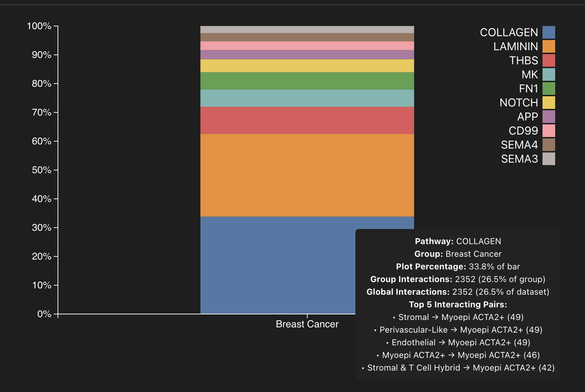

# Pathway Proportion Plot
Sometimes we might be interested to understand what the key functional processes in our cellular interaction data are. Where interaction data has pathway information we can plot a stacked proportion barplot to see what processes our interactions are feeding into. Here we can plot the relative frequency of the top pathways split by groups, this is particularly interesting if you have multi-condition or multi-sample interaction data. 

First, navigate to the sidebar and select the column in your cellular interaction data that contains the functional pathway information, the drop-down menu will contain all the column names in your data but you can also start typing your column name and it will appear at the top. 

Next select your desired grouping column, usually this would be condition or sample. By default the plot will show you the top 10 pathways that are present in your interaction data, this can be changed using the drop-down menu where the plot will automatically update. 

When you hover over each segment in the stacked barplot a hover box will appear that will tell you additional information about the pathway, such as:
    - The name of the pathway
    - The group variable
    - The relative percentage of the segment in the barplot
    - The percentage of the interactions of the given pathway in the group
    - The percentage of the interactions of the given pathway in the whole dataset
    - The top 5 interacting cell types with the number of interactions they have that feeds into the pathway

The plot can also be exported as a PDF by clicking the 'Save as PDF' button in the sidebar for further use.

NB: For the number of pathways above 10 the colour map will repeat, however the colour legend is still ordered by the descending appearance in the plot and will remain unchanged.