# Single Cell View

This tab allows the user to explore and visualise their single cell or spatial data. Using visualisation components from the Vitessce library you can visualise both modalities of data side by side. The single cell data is projected in the UMAP embedding space with the spatial data projected as a spot level mask overlaid on the histological image where available. 

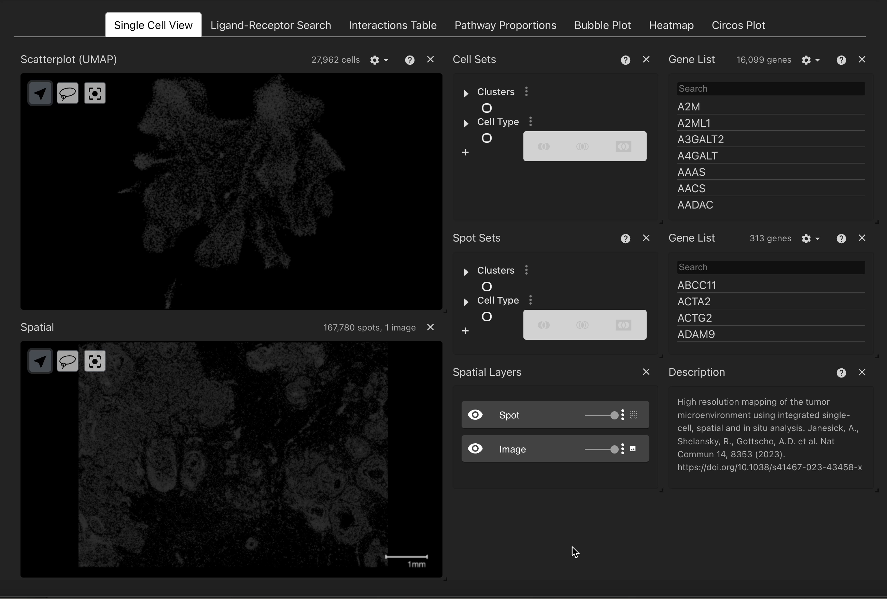

## Explore data using metadata or gene expression
The user can visualise their data with any available categorical metadata such as leiden cluster or annotated cell type in both their single cell and spatial data. For further downstream tasks the user *must ensure that cell type annotation labels are harmonised* across both datasets. 

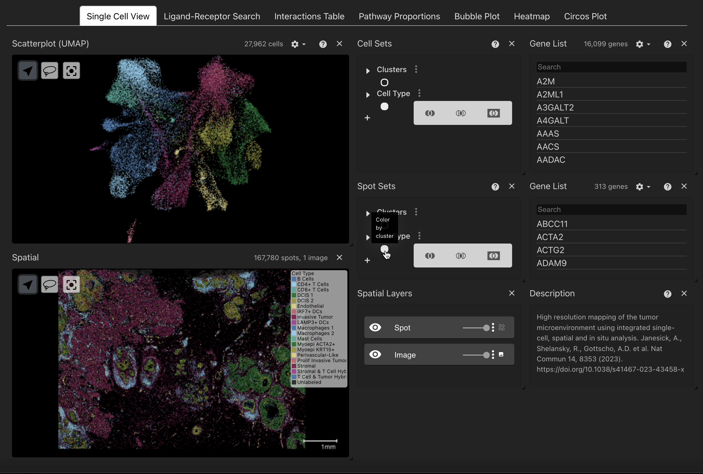

### Cell Sets
The Cell Sets component contains all the categorical metadata associated with your single cell data, categories can be expanded by clicking the dropdown arrow to see all labels. By clicking the highest level toggle button users can visualise all cells by a given metadata variable. Individual or multiple categories of cells can be highlighted by either clicking the label text or by clicking the lower level toggle buttons next to each label, selections can be removed by again clicking on the toggles/labels. Similarly the same may also be done for the spatial view using the Spot Sets component that is located adjacent to the spatial data viewer. 

NB: This may be slow for larger datasets, or categories.

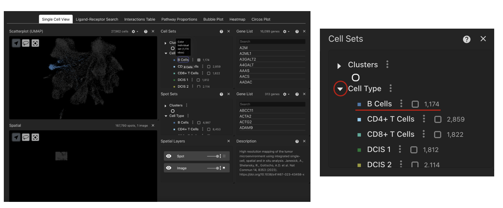

### Gene List
The Gene List component contains all the genes available in the expression matrix of the single cell data. By clicking a gene the UMAP component will highlight the genes expression across all cells in the dataset. The user can also search for a given gene using the search bar at the top of the component. 

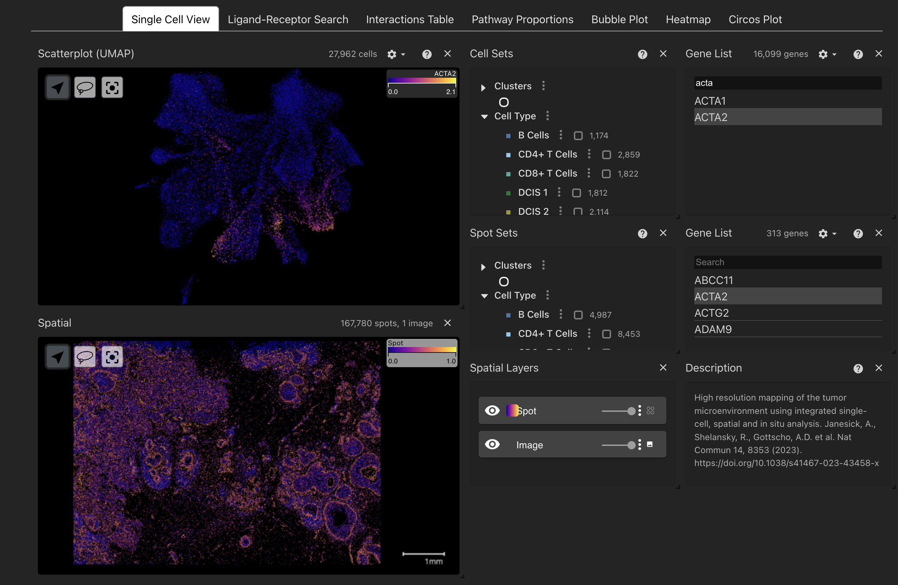

Genes can be ordered by their appearance in the matrix or alphabetically and where alternative IDs are available the user can toggle whether to sort by or display these instead of the original gene IDs. Similarly the same can also be done in the spatial data using the Gene List component adjacent to the spatial data. 

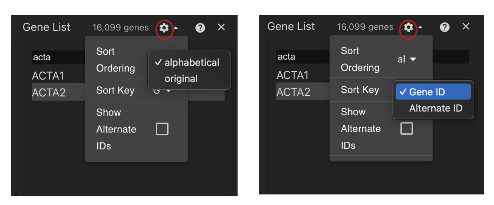

NB: Genes present in the single cell data that are absent in the spatial data still colour by gene expression in the spatial view, fix is pending.

## Spatial View
The spatial view allows users to explore their spatial data on the spot or image level where available. As mentioned above you can colour your spatial data with metadata variables or by gene expression. The spatial view has an additional level of control provided by the Spatial Layers component. This component allows users to show/hide the spot level mask or histological image where available as well as sliders to adjust the opaicity of each layer. By default the viewer initally shows both the spots and image with the image contrast set to 0 so that the spots are visualised more clearly.

### Image layer
To adjust the contrast of the image layer, it may help to hide the spot mask so it doesn't interfere with our settings. To do this we can hide the spot layer by clicking the eye icon, then we can click the 3 dots to open the image settings. 

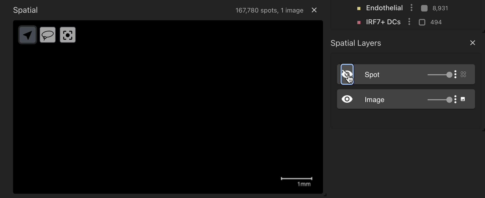

Here we can set the 'Photometeric Interpretation' to 'BlackIsZero' and we see that we now have a channel that has appeared. Now if we collapse the menu by clicking on the 3 dots again we can adjust the intesity of the colours by moving the right slider closer to the left slider to acheive the desired contrast. This is set to blue by default and can be changed by clicking the solid blue box next to the channel where the user can select their desired colour. 

We can also set this to use a colour map instead of a solid colour by clicking on the 3 dots next to the image layer slider and selecting a colour map. 

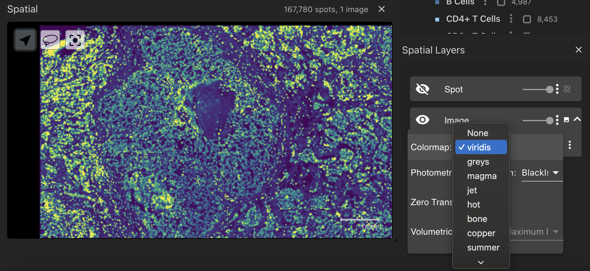

If you zoom in you can clearly see the intensity staining from the image with the colour map overlaid. Now if you retoggle the spot layer we can clearly see the spot mask overlaid on the image. 

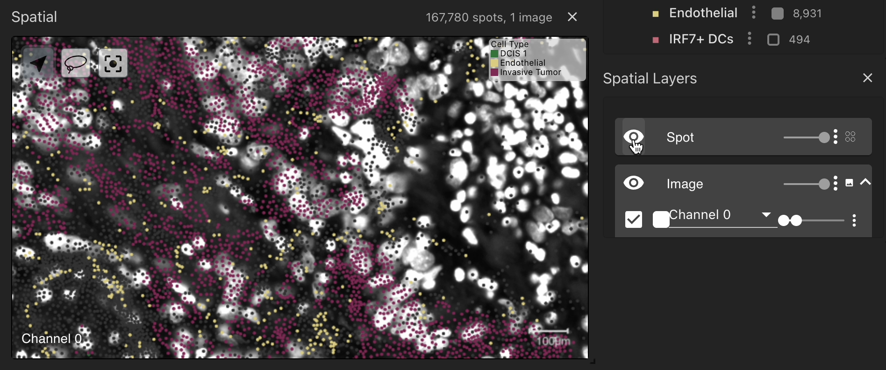

## Creating selections of cell sets 
You can also subset specific cell populations of interest using the Cell Sets component that is linked to the single cell viewer. Any selections made will be stored under 'My Selections' that will appear in the Cell Sets component. 

### Subsetting by metadata
Cell populations can also be saved as a selection based on their metadata in the Cell Sets component. For this functionality click using the toggle buttons next to each label in the Cell Sets view, selected cells will be highlighted in the UMAP. Once the cell populations of interest are selected the user can save the selection in three distinct ways:

- **Union:** This will take the union of all selected metadata variables.

- **Difference:** This will take all the cell populations that are outside the selection.

- **Intersection:** This will take the intersection of all selected populations. This is more powerful when used with lasso selections rather than metadata selections. 

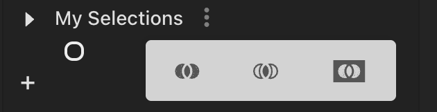

Cell populations of interest that appear under 'My Selections' can also be used to create new selections using the three functions above. Simply select selections of interest and click on one of the three joins to create a new selection.

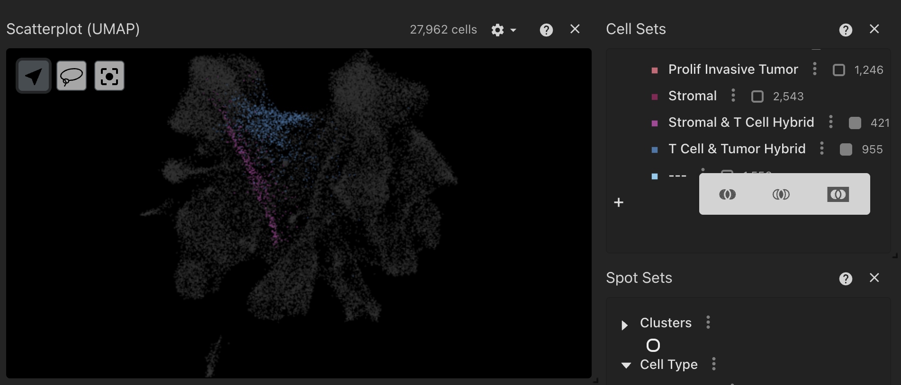

By clicking on the 3 dots next to each selection you can rename the population of interest, change their colour, delete, highlight, or export them to a JSON or CSV file. These cell set selections will be stored and carried over to other visualisations in the tool to explore cell-cell interactions. 

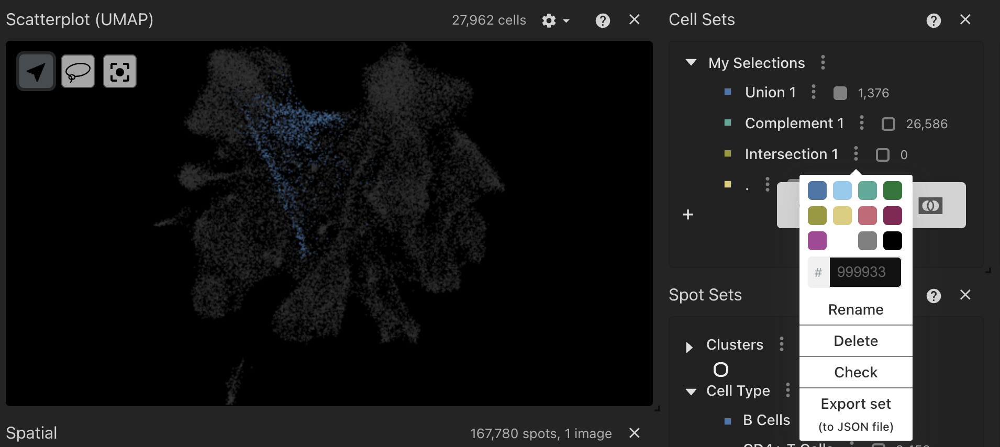

NB: Selections must be made in the single cell viewer, so if you are interested in cell types that localise in the spatial view please explore these seperately first and then create the selection in the single cell view. This is due to how the tool handles cell barcodes associated to the cellular interaction data that is inferred from the single cell data. Functionality extending creating selections from the spatial data to communicate with the interaction data is coming.

### Subsetting by lasso selection
Cell populations can be saved as a selection by using a convenient lasso function in the UMAP component in the single cell view. By selecting the lasso tool, the user can click and drag a selection of cells which can be saved and passed to other plotting tabs. Once the lasso selection is complete the selected cells will be highlighted and the subset will appear in the Cell Sets component under Selections. To create another lasso selection you only need to select another population of interest and these will all be saved under 'My Selections' in the Cell Set component.

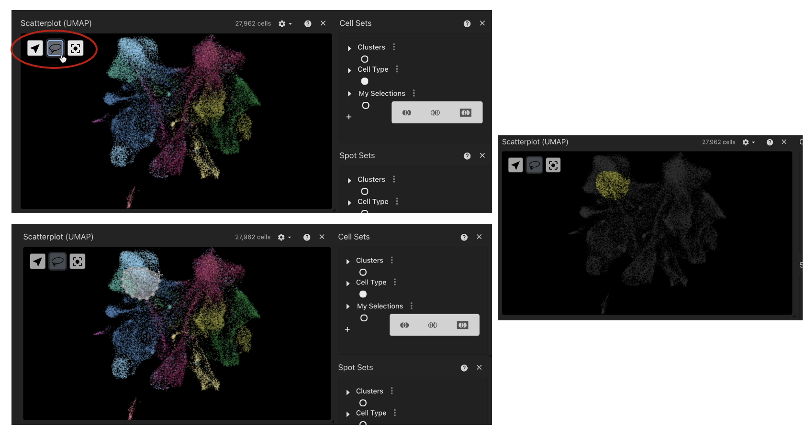

NB: Larger selections may be slower to load so please be patient until the selection appears under 'My Selections'.

Now we have explored our single cell and spatial data, created selections of populations of interest and can now carry these over to the plotting tabs to visualise some cellular interactions. 